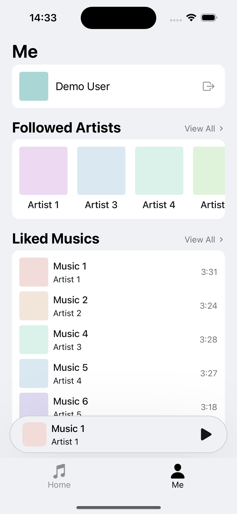

# React-Native-Music-App-Demo

This is a music app demo built with React Native. It only contains the UI, and there is no communication with any API or server.

Some features in the UI are not finished yet, such as searching for artists and musics.

## Running the App

1. Install the dependencies:

    ```bash
    npm install
    ```

2. Start the app:

    ```bash
    npx expo start
    ```

3. Follow the instructions provided in the output on how to run the app on different platforms.

After starting the app, click either "Log In" or "Create an account", and then click the button in the next screen directly to enter the app. You don't need to enter any information in the textfields, although you may do so, which won't affect the sample data that will be created in the app.

## Screenshots

Here are some screenshots of the app on iOS.

<p>
    
    
    
    
	<br>
	
    
    
    
</p>

## Notice

This is for educational purposes only and should not be used for commercial purposes.

## License

This is licensed under the MIT license. See [LICENSE](./LICENSE) for more information.
